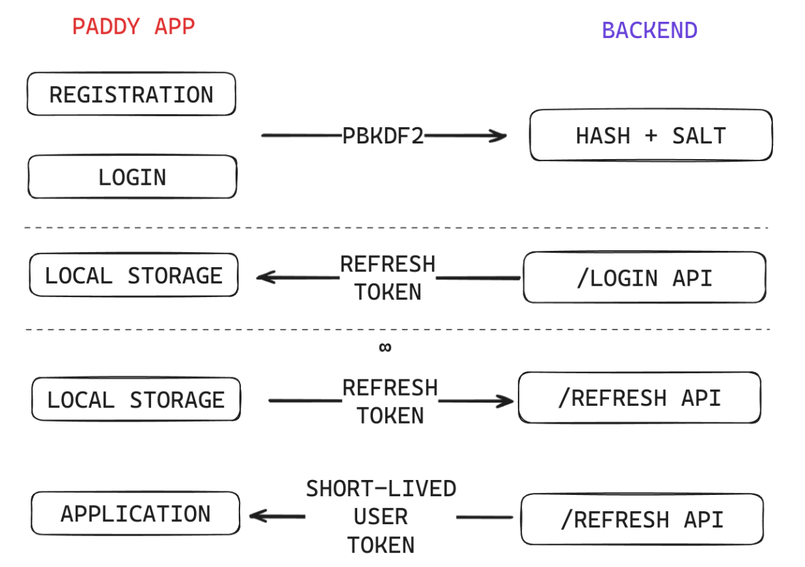
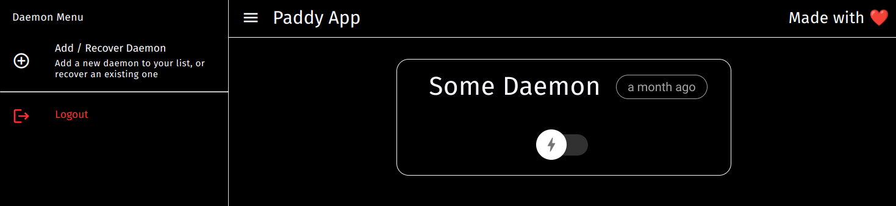
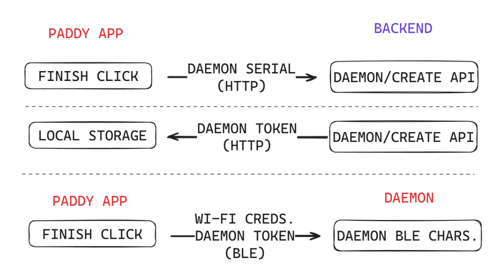
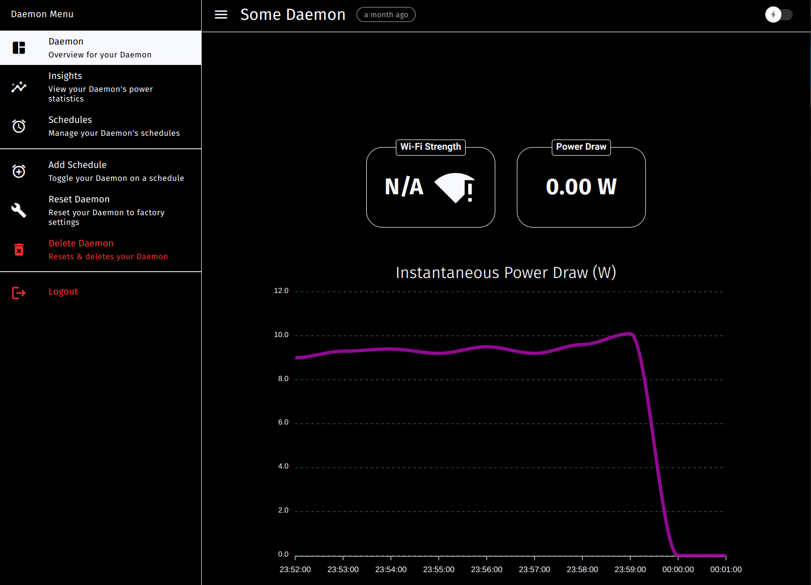
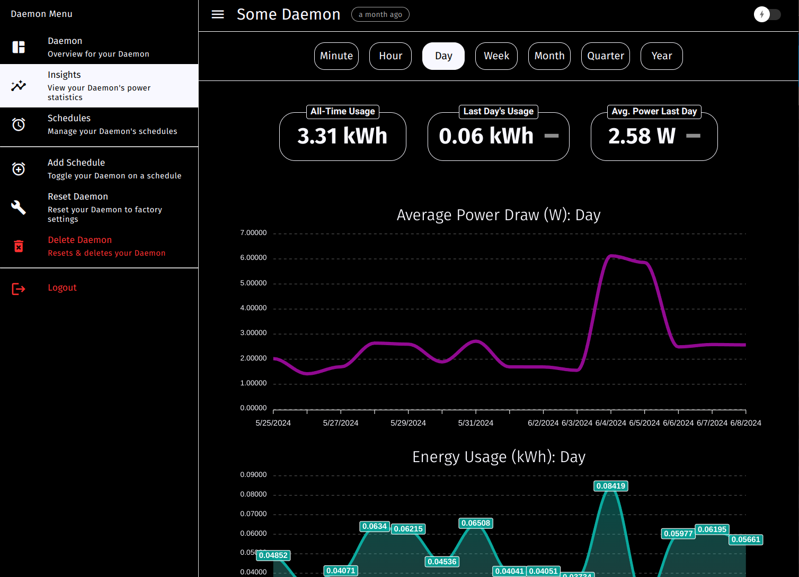
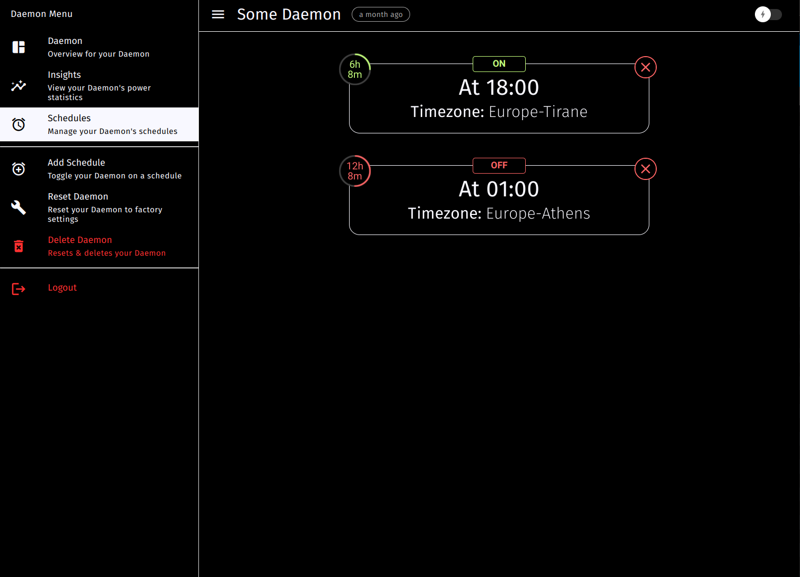

<p align="center">
    
</p>

# Overview

This is the user interface component for Paddy, the Power Administration Daemon.

It uses [Quasar](https://quasar.dev/), with Capacitor for mobile deployment, and the [BLE Capacitor plugin](https://github.com/capacitor-community/bluetooth-le) to interface with the Daemon(s).

The job of this application is to serve as a neat user interface for managing Daemons in their whole lifecycle, including setup, toggling, power measurement, statistics and any necessary error handling.

# Login Screen

<p align="center">
    
</p>

One of the primary duties of the application is to provide a safe and quick way for users to access the application. This is done through a simple login form, with the option to Login or Sign Up, each option redirecting the user to their respective form.

Whilst simple, this login/registration flow was not to be underestimated as user credentials management is one of the most important aspects of an application. Although the communication between the application and the backend is done over HTTPS, extra steps were taken to make the password in its plaintext form never leave the user’s device. This was done while respecting OWASP principles on cryptography. The process is as follows:

1. The user types their password on the login form.
2. Upon clicking “Sign Up”, the password is immediately encoded with the PBKDF2 algorithm with 210,000 repetitions and 256 bits, using SHA-512 for hashing.
3. The encoded password is sent to the backend, which again re-encodes the hashed password with a random salt value that does not leave the backend, and stores both the output + salt in the database.
4. Upon subsequent logins, a similar process is followed. However, when the hashed password arrives in the backend, it is hashed again with the previously generated salt. If the output of PBKDF2 is the same as the saved hash from the registration flow, login is granted.

Even if the connection were monitored by a third party and the hashed password was compromised, they would need to brute force it for a very long time.

## Refresh Token

Although this may be sufficient, even more is done to maintain the security of the user’s credentials through the replacement of the user’s password altogether during subsequent needs for login. For instance, after the user has logged in, it is in their interest to stay logged in that device if it is trusted. As such, after a successful login, the backend sends back a refresh token with a lifespan of one month to the application. These would be the claims of a valid refresh token in its unencoded form:

```json
{
  "sub": "Bonkers D. Bobcat",
  "iss": "https://danielstefani.online",
  "iat": 1714151983,
  "exp": 1716743983,
  "aud": "paddy~refresh",
  "rts": "12345"
}
```

Do also note the existence of the rts field in the claims of the refresh token. This is the Refresh Token Serial, a value which is generated by the backend every time a user changes their password. This field is there in case a malicious actor retrieves the refresh token of another user, as short-lived user tokens are only returned to refresh tokens with a valid Refresh Token Serial. As such, if the user realizes that their account has been compromised and therefore changes their password, all their previous refresh tokens will immediately become invalid, although they may not be expired yet.

Using the device’s local storage, this token is stored for future use (but cleared upon the user deciding to log out of their account). After the app has been closed and the user opens their session again, this refresh token is used to call the backend and retrieve a more short-lived user token, which lasts for only 300 seconds. It must be noted that the refresh token does not have access to any of the backend’s APIs other than the one to retrieve a short-lived user token.

<p align="center">
    
</p>

# Home Page

Upon logging in, the user is greeted with a page that puts them in the control seat for their Daemons.

<p align="center">
    
</p>

Existing devices can be turned on and off through the toggle switch button. If the user is to integrate new devices, they can do so through the Add / Recover Daemon button.

## Add/Recover Daemon Flow

When the user wishes to integrate a new Daemon, they are accompanied by a Wizard-style state machine, which makes things easy. Under-the-hood, though, the application performs many tasks necessary for the initialization of the new device. This is done through Bluetooth Low Energy, in this order:

1. The user taps “Next”, which initializes a native pop-up reflecting the phone’s scans for BLE devices.
2. When the user has chosen the Daemon in the device list, the application reads the BLE Serial Characteristic of the device, retrieving the Daemon’s Serial Number.
3. Next, the user is guided through the process of entering the Daemon’s Wi-Fi credentials, which will be used by the device to connect to the server.
4. Once this process is complete and the user finishes the Wizard, the application contacts the backend server, retrieves a long-lived JWT for the Daemon, and simultaneously writes the JWT & Wi-Fi Credentials to the Daemon for storage.

<p align="center">
    
</p>

At the end of this process, the Daemon is fully set up. However, if the user wishes to change the Wi-Fi credentials at any point, they can easily do so in the settings of the next screen.

## Mission Control Page

In the mission control page, the user has instant access to all the critical information and operations related to the Daemon. In the “Overview” section, one can observe the Wi-Fi signal strength of the Daemon, the instantaneous power draw of the load device and an accompanying live graph with minute-to-minute updates.

<p align="center">
    
</p>

## Insights Page

If the user is interested in more refined information, they can access the “insights” section, a rich dashboard with aggregated information relayed from the Daemon over an arbitrary period of time. This includes an all-time cumulative usage of the load device, alongside the cumulative and instantaneous usage over a unit of time. The feature that makes this dashboard more interactive is that the user is able to choose the unit of time they want to have data crunched for, which is done on-the-fly. Furthermore, trend-indicating arrows and live charts give the user a full sense of control over their device.

<p align="center">
    
</p>

## Schedules Page

The schedules page is where the user can make plans to toggle the Daemon on or off ahead of time. Single and periodic schedules are both supported, using Cron expressions to declare periodic actions. Each schedule element shows the scheduled time, the action it will perform, and the remaining time until it executes.

<p align="center">
    
</p>

## Management Options

There is easy access to other management options from the side-menu, specifically:

- Adding a New Schedule
- Resetting a Daemon
- Deleting a Daemon.

> All options bring up specific modal menus and carefully advise & inform the user on the action they are trying to perform.
